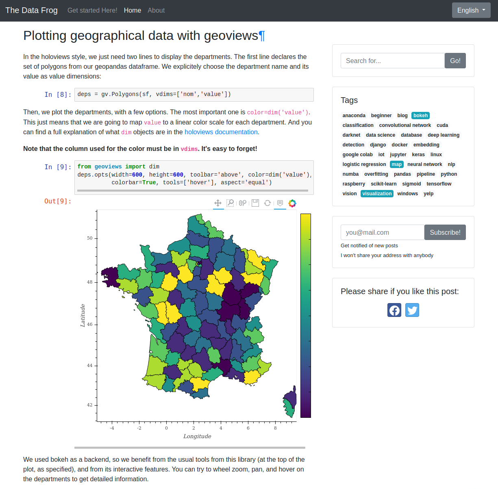

# Jupyter Notebook Web Page integration

This repository demonstrates how to perform a full integration of a jupyter notebook in a web page. 

The code is highlighted with [pygments](https://pygments.org/). Math equations are rendered with [MathJax](https://www.mathjax.org/). The jupyter notebook is converted to HTML with [nbconvert](https://nbconvert.readthedocs.io/en/latest/). The main style is from [bootstrap](https://getbootstrap.com/). Custom CSS classes are provided in this repo for a  consistent style between the included jupyter HTML file, and the mother HTML page. 

This setup is fully explained in my article [https://thedatafrog.com/jupyter-notebooks-web-pages]().

## Description of the repository

The file [templates/overfitting.html](templates/overfitting.html) has been generated with 

```
jupyter nbconvert --execute --template basic overfitting.ipynb
```

[templates/main.html](templates/main.html) is the template web page in which we want to include 

[render.py](render.py) is a simple custom python script that generates [index.html](index.html) from the template. This script is just for demonstration purposes. For real websites, I use django and its template engine. 

the [css](css) directory contains custom CSS classes for the styling of the various elements in the web page: 

* [css/main.css](css/main.css) : main styling 
* [css/notebook.css](css/notebook.css) : styling of the jupyter notebook elements (e.g. input and output prompts, images, ...)
* [css/pygments/notebook/colorful.css](css/pygments/notebook/colorful.css) : highlighting style for code in the jupyter notebook

## Rendering the HTML file

Just do

```
python render.py
```

And open the resulting `index.html` in your browser to see the results. 

**If you edit `template.html` do not forget to render again.**

## Results

Here is what I get in my django website: 


